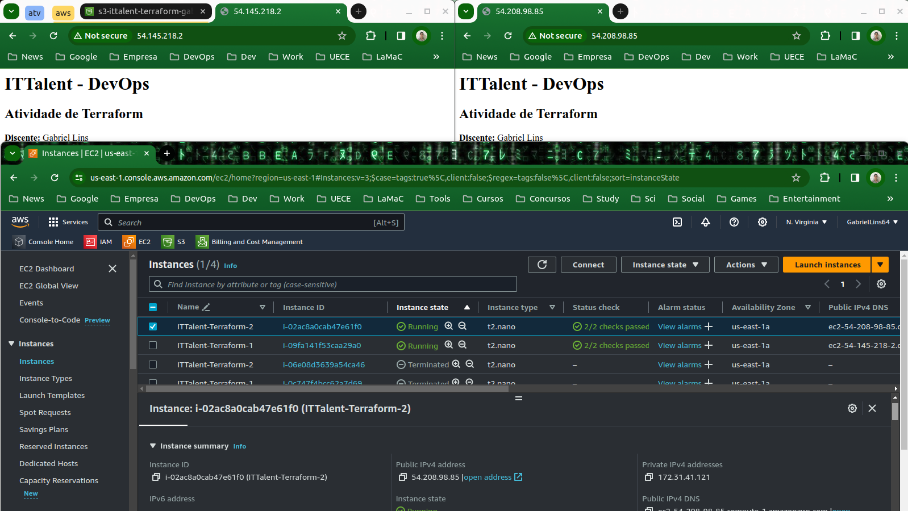

<h1>Atividade prática - Terraform</h1>

Relatório da Atividade prática de Terraform.

**Curso:** DevOps - IT Talent 

**Turma:** 2023.2

**Docente:** Helton Lima

**Discente:** Gabriel Furtado Lins Melo

---

## Etapas da atividade

- [X] Subir 2 instancias EC2

- [X] Via terraform realizar instalação e configuração automatica do nginx para servir como proxy reverso e mandar as requisições para o bucket s3

- [X] Subir 1 Bucket S3

- [X] Via terraform deixar o bucket publicamente acessivel e pronto para hospedar um site estático

- [X] Subir os arquivos do site estático dentro dentro do bucket iguais os que fizemos na atividade prática de aws (https://github.com/heltonlima20/ittalent-devops-aws)

- [X] No final subir infraestrutura e acessar o site estático através do DNS público da Ec2

## Visualização:

